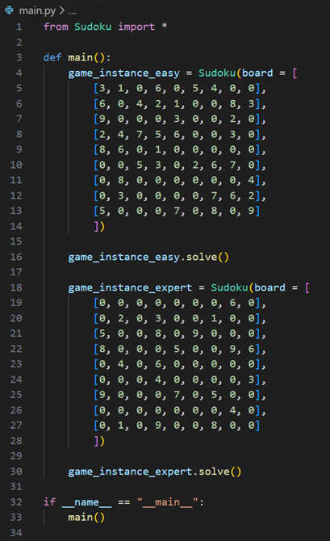
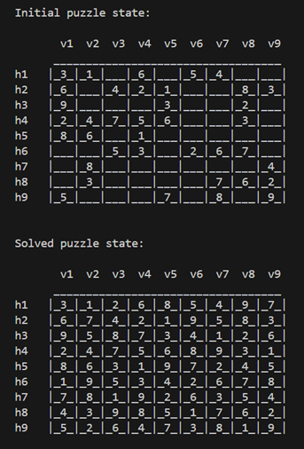
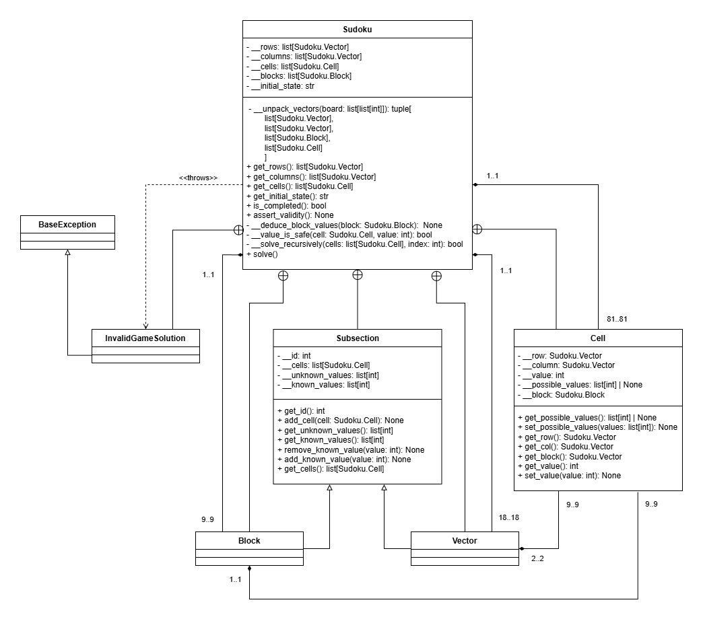

# Sudoku Solver

This project is now completed, but may be revisited in the future to have additional features added. The Sudoku Solver takes an input representation of a Sudoku puzzle as a list of lists of integers, where 0 represents missing values, and then solves the puzzle in an efficient manner. The approach I chose was to firstly invent my own algorithm to solve the problem, and then to look up well-established methods online, so that I could do a side-by-side comparison and gain new insights into how I could better approach similar problems in the future. I also used the knowledge I gained from the research to improve my algorithm, specifically to make it handle edge cases significantly more efficiently.

## Example use-case

The file _main.py_ contains example code that one can easily alter to one's needs. It looks as follows:

For each Sudoku variable added, its solved output looks something like so: 

Each column is labelled "v" as in "vertical", and every row is labelled "h" as in "horizontal". For easy comparison, the initial puzzle state is also printed to the console.

## Program structure

### Class composition 

In this project, I've used object-oriented programming. The reason for this was not because it is most efficient in this particular case, but to demonstrate my proficiency with that programming paradigm. For an overview of the software itself, consider this UML class diagram:

The Sudoku class is the main class, containing 5 inner classes. Of these inner classes, Block, Vector, and Cell are compositional. Each block of the puzzle contains 9 cells (3 x 3), and each vector (i.e. row or column) contains 9 cells as well. Since a sudoku puzzle is a 9 x 9 grid of cells, each instance of Sudoku requires there to be 81 instances of Cell. As is considered good practice, all attributes are private, while only selected methods are public.

### Puzzle-solving algorithm

Initially, I designed code that would solve sudoku puzzles using the same sets of logic as a human would use. For each cell, the program would check which possible values it could have based on the two vectors and the block containing it. If only one value was possible, it would assign that value to the cell and then start over from the beginning. This works very well for simpler puzzles, but expert level puzzles require guesswork to be completed, which my initial algorithm didn't support. Upon researching methods, I learned that my chosen one is known as the heuristic approach or constraint programming. The method has to be complemented with the backtracking approach to be viable for the most difficult puzzles, so I updated my code to recursively fill in numbers in the empty cells (only from their range of possible values) to successively locate missing values. This method is only called if the deductive method at any iteration fails to update any cell values. This ensures that the more resource-heavy brute-force method isn't applied unless necessary.

## Project plan

### Completed steps

1. Preparation: Analyze requirements. Work out preliminary Sudoku puzzle solving logic. Make a plan for which classes and data collections to include to efficiently run the puzzle-solving algorithm.

2. Create rough drafts of the Sudoku module's classes, including of its data collections.

3. Add data structures for missing numbers by row, column, and blocks.

4. Introduce `solve()` and `assert_validity()` methods.

5. Refine and test. Flesh out and improve upon the documentation.

6. Research other, more well-established Sudoku algorithms online. Compare these to my solution and analyze its potential shortcomings. 

### Potential future steps

7. Introduce more types of accepted inputs, e.g. by image. Create a method for checking if a Sudoku puzzle is able to be solved, or if it has multiple solutions.
